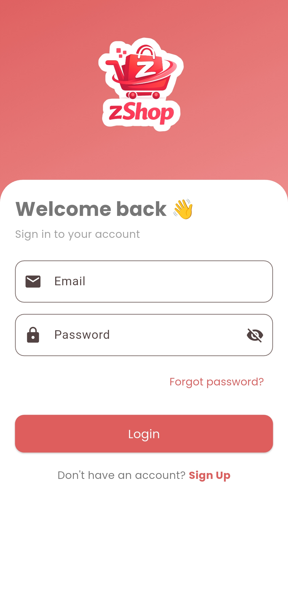
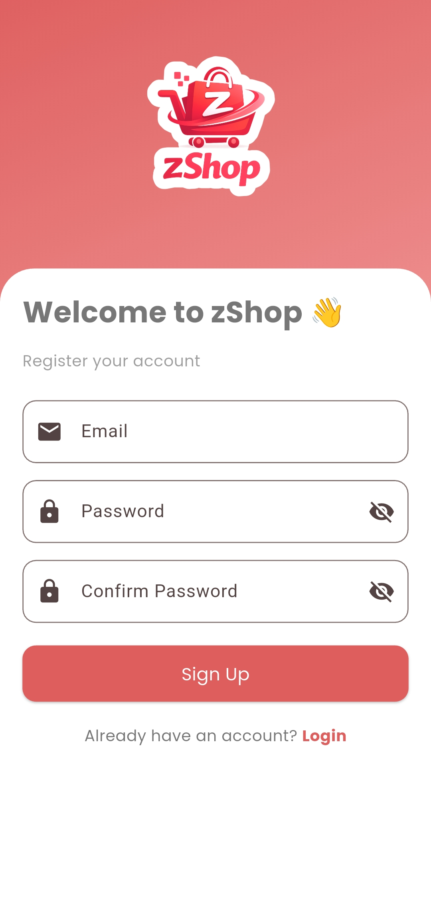
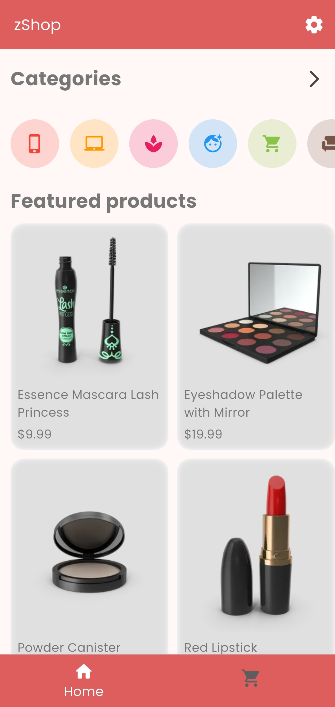
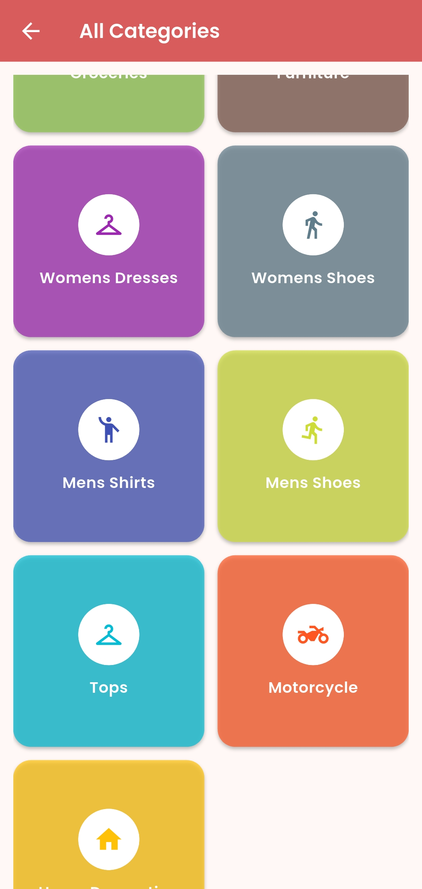
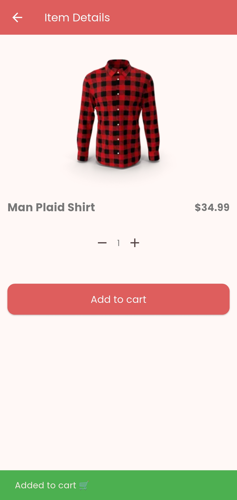
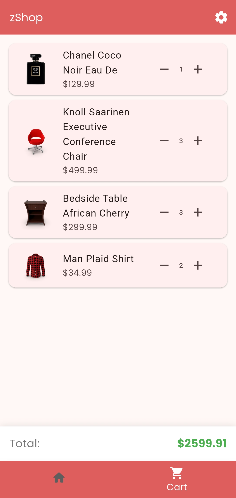

# 🛒 zShop - Flutter E-Commerce App

zShop is a modern Flutter e-commerce application integrated with Firebase Authentication, built with clean UI, product browsing, cart system, and category filtering.

---

## ✨ Features

- 🔐 Firebase Authentication (Login / Sign up / Logout)
- 🏠 Home page with categories & featured products
- 📦 Product details page
- 🛒 Cart system with quantity control
- 📂 Category filtering
- 👥 About Us page
- ⚙️ Settings page
- 🎨 Clean UI with Google Fonts
- ⚡ Smooth navigation & animations

---

## 🎯 Future Improvements

- 💳 Payment integration
- ❤️ Wishlist feature
- 🌙 Dark mode
- 🔍 Search functionality
- 🌏 Arabic Language
---

## 📸 Screenshots

|  |  |
|-------------------------------|-------------------------------|
|  |  |
|  |  |
---

## 🧱 Tech Stack

- Flutter
- Dart
- Firebase Auth
- Google Fonts
- Material Design 3


---

## ⚙️ Installation

### 1️⃣ Clone the repo

```bash
git clone https://github.com/your-username/zshop.git
cd zshop
```
## 🚀 Getting Started

### 1. Install dependencies
```bash
flutter pub get
```
### 2. Run the app

```bash
flutter run
```

## 🔥 Firebase Setup

1. Create a Firebase project
2. Enable Authentication (Email/Password)
3. Run:

```bash
flutterfire configure
```
